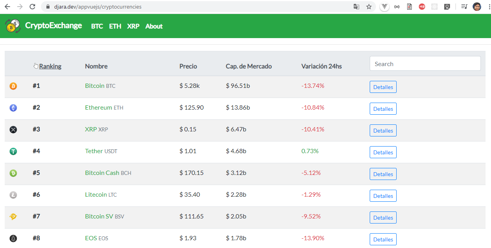
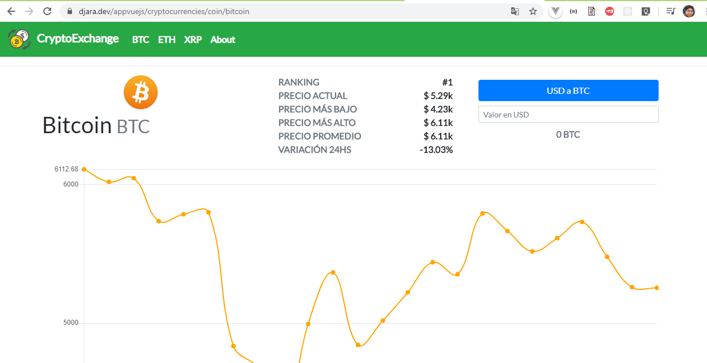

# Aplicación de Criptomonedas - CoinCap API 2.0

## Descripcion

```
CoinCap es una herramienta útil para la fijación de precios en tiempo real y la actividad del mercado
para más de 1,000 criptomonedas.
Al recopilar datos de intercambio de miles de mercados, podemos ofrecer datos transparentes y precisos
sobre el precio y la disponibilidad de los activos.

La API ofrecerá información sobre exactamente qué intercambios y mercados contribuyen a nuestros precios.

Una sola página ofrece 100 respuestas de forma predeterminada y admite hasta 2,000 respuestas por
página a solicitud.
```

## Frontend de la Aplicacion




### Compila y recarga los archivos en modo Desarrollo

```
npm run serve
```

### Compila y Minimiza los archivos para el despliegue de Producción

```
npm run build
```

### Configuración Personalizada

See [Configuration Reference](https://cli.vuejs.org/config/).
